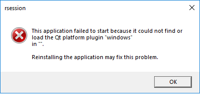
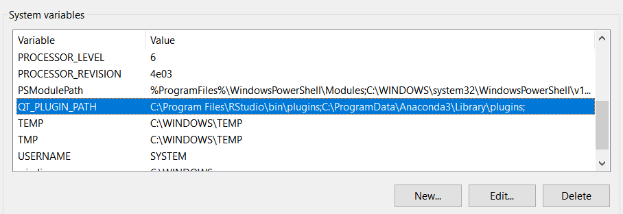

# useR2019_tutorial

## Keeping an exotic pet in your home! Taming Python to live in RStudio because sometimes the best language is both!

### Pre-tutorial instructions

#### Software and packages

Participants need a laptop with [RStudio 1.2](https://www.rstudio.com/products/rstudio/) and [Anaconda 3](https://www.anaconda.com/distribution/) installed. 

Please also install the `reticulate` package and I recommend the development version from github. Installing packages from github requires first installing the `devtools` package from CRAN:

`install.packages("devtools")`

You should be then able to install `reticulate` with:

`devtools::install_github("rstudio/reticulate")`

You can read more about `devtools` here: https://www.r-project.org/nosvn/pandoc/devtools.html

We will also use `readxl` and `ggplot2`. Please also install them from CRAN.

#### Tutorial materials
Download this repository. You can do this with the green `Clone or download` button above and selecting Download ZIP.

Extract the files.

#### Information
Please make a note of where your RStudio and Anaconda3 plugins are located. For example, on my windows machine they are:

`C:\Program Files\RStudio\bin\plugins`  
`C:\ProgramData\Anaconda3\Library\plugins`

#### Tester
This file should help you discover if you are set up for the tutorial.

Start RStudio, open tester.Rmd and hit the knit button. 

If all goes well, you should get this output: [tester.html](https://3mmarand.github.io/useR2019_tutorial/tester.html)

#### qt platform plugin Error?

Did you get this error: 

*This application has failed to start because it could not find or load the qt platform plugin "windows" in "" *

Some people seem to get this error but not everyone. I've seen it on some windows machines.

You need to set your QT_PLUGIN_PATH environment variable to where the RStudio and Anaconda3 plugins are located 

In windows: Control Panel -> System and Security -> System then

Advanced System settings -> Environment variables

I have set mine to:

`C:\Program Files\RStudio\bin\plugins; C:\ProgramData\Anaconda3\Library\plugins`

You may need to add a new variable. The order of the paths matters - make sure you have the `C:\Program Files\RStudio\bin\plugins` first.

If you can describe, resolve or circumvent this in a better but still minimal way, please get in touch!

#### Mac user with a Error?
A couple of mac users reported an error "No module named pandas"

This solution given by William Farin - Thank you William!!

Create as Renviron. File in a terminal:

`touch $HOME/.Renviron`

`open $HOME/.Renviron`

Include inside the file:  

`RETICULATE_PYTHON=/anaconda3/bin/python3`

Close.

Restart RStudio and you hopefully find the tester can now be knitted.

#### Help!
If you have any problems with the pre-tutorial instructions please get in touch with me on emma.rand@york.ac.uk and I'll do my best to help.

### During the tutorial

View the [Slides](https://3mmarand.github.io/useR2019_tutorial/#1)

View the [Classification of Audio segments by instrument example](https://3mmarand.github.io/useR2019_tutorial/music_ml/Classifiying_music.html)

 

 user2019 Tutorial: Taming Python to live in RStudio by Emma Rand is licensed under a <a rel="license" href="http://creativecommons.org/licenses/by-nc-sa/4.0/">Creative Commons Attribution-NonCommercial-ShareAlike 4.0 International License</a>.

