```{r setup, include=FALSE}
knitr::opts_chunk$set(echo = TRUE, 
                      message = FALSE,	
                      warning = FALSE)
options(htmltools.dir.version = FALSE)

```

background-image: url(pics/useR2019.png)
background-position: 4% 0%
background-size: 250px


class: inverse, right, bottom

# Keeping an exotic pet in your home!
## Taming Python to live in RStudio because<br>sometimes the best language is both!
<br>
### Emma Rand<br>emma.rand@york.ac.uk


---
class: center, middle

# But first.....Who am I?

---


# Who I am?

.pull-left[


]

.pull-right[

Lecturer (Assistant Professor) University of York, UK

some other stuff

]

---
background-image: url(pics/member_institute_logos.png)
background-position: 95% 7%

# Thank yous!

## To the local organisation committee

* Nathalie Vialaneix (chair), MIAT, INRA  
* Sébastien Déjean (vice-chair), Institut de Mathématiques de Toulouse, Université Toulouse 3 Paul Sabatier  
* Anne Ruiz-Gazen (vice-chair), Toulouse School of Economics, Université Toulouse 1 Capitole  
* Heather Turner (vice-chair), statistical consultant and associate fellow of the Statistics Department at the University of Warwick  
* Aurore Archimbaud, Toulouse School of Economics  
* Christophe Bontemps, Toulouse School of Economics, INRA  
* Robert Faivre, MIAT, INRA  
* Xavier Gendre, Institut de Mathématiques de Toulouse, Université Toulouse 3 Paul Sabatier  
* Thibault Laurent, Toulouse School of Economics, CNRS  
* Élise Maigné, Observatoire du Développement Rural, INRA  
* Pierre Neuvial, Institut de Mathématiques de Toulouse, CNRS  
* Rémi Servien, InTheRes, INRA  
* Matthias Zytnicki, MIAT, INRA  

---
# Thank yous! 

## For funding

.pull-left[
To the organisers and their sponsers


]

.pull-right[


My institution  


]


---
# Thank yous! 

## Leila Khajavi

Hi Leila! would you like to give me a picture and biography?

---
# Thank yous! 
## Everyone here for coming!

---
background-image: url(https://upload.wikimedia.org/wikipedia/commons/f/f8/Python_logo_and_wordmark.svg)
background-position: 95% 95%
background-size: 250px

# Why `reticulate`?

You finally found the **perfect** solution to a data problem!

### `r emo::ji("grin")`

--

but it's written in Python  

### `r emo::ji("grimace")`

--

You're collaborating with some great people

### `r emo::ji("grin")`

--

but they mainly use Python!  
You want to collaborate more easily and seamlessly. 

---
# Why `reticulate`?

You could move to the darkside `r emo::ji("snake")`...

But you're familiar `r emo::ji("blue heart")` with R...


---

# Why `reticulate`?

But you're familiar with R  
**and very at home in RStudio...**  
&nbsp;  
&nbsp;  
&nbsp;  

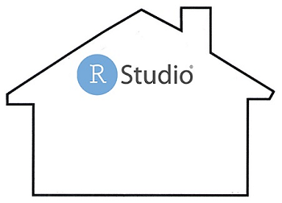

---
# Why `reticulate`?

But you're familiar with R  
and very at home in RStudio  
**because it's comfortable...**  
&nbsp;  
&nbsp;  

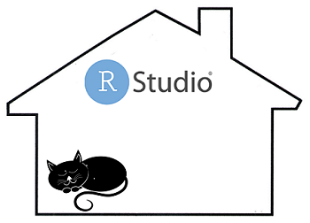

---
# Why `reticulate`?

But you're familiar with R  
and very at home in RStudio  
because it's comfortable  
**and has many tools you like...**  
&nbsp;  

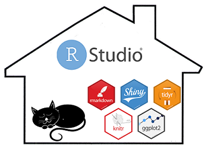
---

# Why `reticulate`?

But you're familiar with R  
and very at home in RStudio  
because it's comfortable  
and has many tools you like  
**and the sun always shines!**  

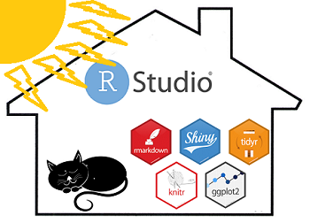

---
# Why `reticulate`?

So even though Python has some great tools...  
&nbsp;  
&nbsp;  
&nbsp;  
&nbsp;  

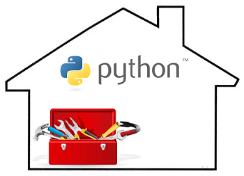


---
# Why `reticulate`?

So even though Python has some great tools  
**and some very cool people...**  
&nbsp;  
&nbsp;  
&nbsp;  

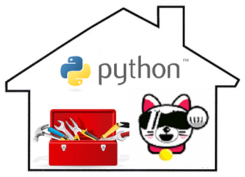

---
# Why `reticulate`?


So even though Python has some great tools  
and some very cool people  
**you don't want to move in!**  
&nbsp;  
&nbsp;  

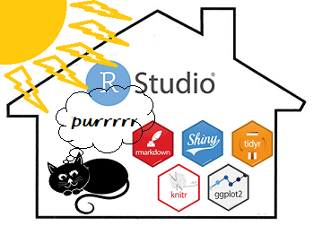

---

# Why `reticulate`?

Thankfully, there's Reticulate

JJ Allaire, Kevin Ushey and Yuan Tang (2018). reticulate: Interface to 'Python'. R package version  1.10. https://CRAN.R-project.org/package=reticulate  

&nbsp;  

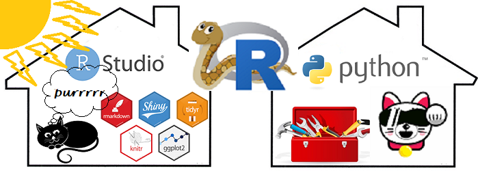


---

class: inverse, center, middle

# Overview

---

# Overview

* Very brief background to R and Python  
* Broad overview of [Reticulate](https://rstudio.github.io/reticulate)  
  Why use it, what are its key features, how can it be used, set up recommendations  
* Aside: A little basic Python  
  Assignment, data types and structures, importing modules, methods, some differences an R user will notice  
* Examples of using `reticulate`  
  * Interactively using `repl_python()`  
  * Sourcing  Python scripts
  * Importing Python modules 
  * Complete integration in R markdown  

---

# Background

```{r table, echo=FALSE, paged.print=TRUE}

comparision <- data.frame(R = c("1995",
                                "Ihaka & Gentleman, Chambers",
                                "User-friendly data analysis and visualisation for 'non-programmers'",
                                "Statistics graduates,  Academics, data scientists",
                                "R Markdown, tidyverse"),
                          Python = c("1991",
                                     "van Rossum",
                                     "Object-oriented,
                                     Readable, general purpose programming language",
                                     "Computer Science graduates, Software engineers",
                                     "Integration with web aps, Unified Machine learning API"),
                          row.names = c("Released",
                                        "Author",
                                        "Purpose",
                                        "Users most likely to be",
                                        "Features"))

knitr::kable(comparision, 
             format = "html")

```


---

# Why use Reticulate

## Speed up your workflow

* Problem solving is the defining feature of a data scientist
* Language should be secondary
* Choice of language drive by early impressions of the data. Change in direction later means lost time in translating

## Facilitate collaboration

* Allows you to leverage the skills expertise of the whole team
* Solves the hardest problem in Data Science - People<sup>1</sup>. 
* Many Data Scientists know both and they are happier<sup>2</sup>

.footnote[
[1] Mangano, 2019  
[2] Stack Overflow Developers' Survey, NanoMathius, 2018  
]

---

# Reticulate


exicting implementations

---
# Reticulate

## Key features

1. Ability to call Python from R  

2. Translation between R objects and Python objects  
 
   Can be automatic or explicit  
   RStudio 1.2

3. Flexible binding to different Python environments  


---
# Reticulate

## Alllows you to use Python in four ways:  

1. Interactively in the console: `repl_python()`  
  
   read–eval–print loop (REPL)  

2. Sourcing Python scripts  

3. Importing Python modules  

4. In R Markdown documents  

Methods 2, 3 and 4 are likely to be the ones you would use in a data analysis project. 

However, We will start with `repl_python()` to build our understanding.
---

# Ingredients

* [RStudio 1.2](https://www.rstudio.com/products/rstudio/)  
   1.2 is needed for some of the most useful R Markdown features
--

* The `reticulate` package  
   ```{r eval=FALSE}
   install.packages("reticulate")
   ```
.centre[
]
--

* Python  
  [Anaconda 3](https://www.anaconda.com/distribution/) 
    recommended for data science, includes many useful libraries.
--
    
*  Any other Python modules your Python code depends on (not needed here)

---
background-image: url(https://upload.wikimedia.org/wikipedia/en/c/cd/Anaconda_Logo.png)
background-position: 10% 10%

--
.right[
]

--
.right[
]
---

class: inverse, center, middle

# A little Python (needs finishing)

---
background-image: url(pics/cute-snake.jpg)
background-position: 95% 7%


# Python fundamentals
Suppose you wanted to created an array of 5 numbers. 

In R you might do this as:
```{r eval=FALSE}
r_array <- c(4, 5, 1, 6, 8)
```

In Python you might use a list<sup>1</sup>

some stuff to complete including how lists differ from vectors/arrays esp
2 * [1,2,3] is [1,2,3,1,2,3] not [2,4,6] but fairly brief

.footnote[
[1] Python doesn't have a native array data structure but it has the list.   
]

---
background-image: url(pics/cute-snake.jpg)
background-position: 95% 7%


# Python fundamentals

Instead you might use the [NumPy package](http://www.numpy.org/)<sup>1</sup>. 

You need to `import` NumPy, then use it's array() function.

The Python code looks like this:
```{python eval=FALSE}
import numpy as np
python_array = np.array([4, 5, 1, 6, 8])
```

.footnote[
[1] NumPy is the fundamental package for scientific computing with Python.

]
---
background-image: url(pics/cute-snake.jpg)
background-position: 95% 7%

# Python fundamentals

to include:
assignment - uses equal  
import vs library  
attributes, methods, functions  
print()  

---

class: inverse, center, middle

# How: Using Python in the console
## `reticulate::repl_python()`
---

# Using Python in the console

## Steps

We are going to use Python interactively in the console.  

We will  
* Start a Python session from our R session  
* Create a NumPy array  
* Use the NumPy array  
  * find its size (an attribute)   
  * calculate its mean (a method)  
* End the Python session  
* Access the NumPy array from our R session  
    
---
background-image: url(pics/reticulated_python.png)
background-position: 95% 7%

# Using Python in the console

We are going to be moving between Python and R sessions.

Which could get confusing!

--

What session you are in **at the start of a slide** is indicated like this:

.pull-left[

## `r emo::ji("snake")` _Sub-heading_
You are working interactively with python and your prompt should look like this: 
```{r eval=FALSE}
>>>
```
You may **finish** the slide in an R session
]

--
.pull-right[

## `r emo::ji("blue heart")` _Sub-heading_
You are working interactively with R and your prompt should look like this:
```{r eval=FALSE}
>
```
You may **finish** the slide in an Python session
]


---
background-image: url(pics/reticulated_python.png)
background-position: 95% 7%

# Using Python in the console

## `r emo::ji("blue heart")` Start a Python session

Load the reticulate package
```{r}
library(reticulate)
```
--

And use the function `repl_python()`:

```{r eval=FALSE}
>  repl_python() 
Python 3.6.5 (C:\Apps\ANACON~1\python.exe)
Reticulate 1.10 REPL -- A Python interpreter in R.
>>>  
```

---
background-image: url(pics/reticulated_python.png)
background-position: 95% 7%

# Using Python in the console

## `r emo::ji("snake")` repl_python()

```{r eval=FALSE}
>  repl_python() 
*Python 3.6.5 (C:\Apps\ANACON~1\python.exe)
*Reticulate 1.10 REPL -- A Python interpreter in R.
>>>  
```

* You get a message to tell you what version of Python you're using and where it is  

---
background-image: url(pics/reticulated_python.png)
background-position: 95% 7%

# Using Python in the console

## `r emo::ji("snake")` repl_python()

```{r eval=FALSE}
>  repl_python() 
Python 3.6.5 (C:\Apps\ANACON~1\python.exe)
Reticulate 1.10 REPL -- A Python interpreter in R.
*>>>  
```

* You get a message to tell you what version of Python you're using and where it is  

* `>>>` indicates the Python prompt  


---
background-image: url(pics/reticulated_python.png)
background-position: 95% 7%

# Using Python in the console

## `r emo::ji("snake")` Make a NumPy array

Import the [NumPy package](http://www.numpy.org/)
```{r eval=FALSE}
>>> import numpy as np
>>> 
```
--
and create an array in the console
```{r eval=FALSE}
>>> python_array = np.array([4, 5, 1, 6, 8])
>>> 
```

--
### Success! `r emo::ji("sparkler")` 

---
background-image: url(pics/reticulated_python.png)
background-position: 95% 7%

# Using Python in the console

## Oh! `r emo::ji("confused")`
But nothing appears in your R environment!
  
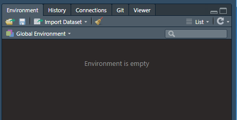

---
background-image: url(pics/reticulated_python.png)
background-position: 95% 7%

# Using Python in the console

## `r emo::ji("snake")` Where is our NumPy array?
Can Python can find it? 
##`r emo::ji("search")`

--

```{r eval=FALSE}
>>> python_array
array([4, 5, 1, 6, 8])
>>>
```
--
## `r emo::ji("thumbs up")` `r emo::ji("hooray")`

Great, the Python session can see it!


---
background-image: url(pics/reticulated_python.png)
background-position: 95% 7%

# Using Python in the console

## `r emo::ji("snake")` Work with a NumPy array

Check the object type of `python_array`:

```{r eval=FALSE}
>>> type(python_array)
<class 'numpy.ndarray'>
>>> 
```

--

Find the size of `python_array` with:

```{r eval=FALSE}
>>> python_array.size
5
>>>
```

--

`size` is an *attribute* of NumPy arrays. 

---
background-image: url(pics/reticulated_python.png)
background-position: 95% 7%

# Using Python in the console


## `r emo::ji("snake")`Work with a NumPy array

Find the mean of `python_array`

```{r eval=FALSE}
>>> python_array.mean()
4.8
>>>
```


---
background-image: url(pics/reticulated_python.png)
background-position: 95% 7%

# Using Python in the console

## `r emo::ji("snake")` Bye bye Python

Let's exit Python
```{r eval=FALSE}
>>> exit
>
```

---
background-image: url(pics/reticulated_python.png)
background-position: 95% 7%

# Using Python in the console

## `r emo::ji("blue heart")` Hello R

&nbsp;

```{r eval=FALSE}
>>> exit
*>
```

The R prompt is returned
---
background-image: url(pics/reticulated_python.png)
background-position: 95% 7%

# Using Python in the console

## `r emo::ji("blue heart")` Now where is `python_array`?

.pull-left[
 
]

.pull-right[
Our environment is still empty
]

--

But we **can** access the Python object using `py$...`

```{r eval=FALSE}
> py$python_array
[1] 4 5 1 6 8
```

---
background-image: url(pics/reticulated_python.png)
background-position: 95% 7%

# Using Python in the console

## `r emo::ji("blue heart")` Accessing python-created objects

And we have normal command completion so typing `py$` followed by the TAB key ⭾ will list the available python objects.


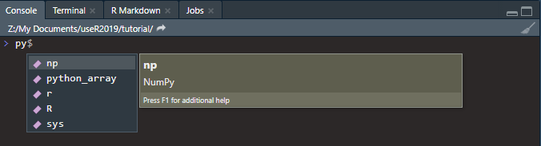

--

Notice we have more than `python_array`. We will return to this in a few slides.
---
background-image: url(pics/reticulated_python.png)
background-position: 95% 7%

# Using Python in the console

## `r emo::ji("blue heart")` Accessing python-created objects

`reticulate` makes these python-created objects behave how you expect them to in R.

```{r eval=FALSE}
> py$python_array * 2
[1]  8 10  2 12 16
```

```{r eval=FALSE}
> py$python_array * py$python_array
[1] 16 25  1 36 64
```

---
background-image: url(pics/reticulated_python.png)
background-position: 95% 7%

# Using Python in the console

## `r emo::ji("blue heart")` R functions on python-created objects

They behave the way you expect them to because they are converted R objects
when used!


```{r eval=FALSE}
> class(py$python_array)
[1] "array"
```
`py$python_array` is a one-dimensional array

numpy.ndarray $\rightarrow$ array

And look! `r emo::ji("look")`
We can use R functions on python-created objects


---
background-image: url(pics/reticulated_python.png)
background-position: 95% 7%

# Using Python in the console

## `r emo::ji("blue heart")` R functions on python-created objects

The mean...

```{r eval=FALSE}
> mean(py$python_array)
[1] 4.8
```
... and length of the array
```{r eval=FALSE}
> length(py$python_array)
[1] 5
```


---
background-image: url(pics/reticulated_python.png)
background-position: 95% 7%

# Using Python in the console

## `r emo::ji("blue heart")` R functions on python-created objects

You can assign the python object explicitly

```{r eval=FALSE}
> r_array <- py$python_array
```

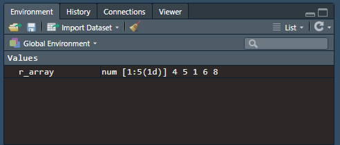
---
background-image: url(pics/reticulated_python.png)
background-position: 95% 7%

# Using Python in the console

## `r emo::ji("blue heart")` Python methods on python-created objects

Remember this?


We have access to the `np` object which results from from importing `NumPy` as `np` in our Python session.

This gives us access to all the NumPy attributes and methods.


---
background-image: url(pics/reticulated_python.png)
background-position: 95% 7%

# Using Python in the console

## `r emo::ji("blue heart")` Python methods on python-created objects

.pull-left[

`r emo::ji("snake")` In Python `np` attributes are applied by following the object with a dot: 

_`object_name.attribute_name`_

For example, we found the size of `python_array` with:

```{r eval=FALSE}
>>> python_array.size
5
```
]

--
.pull-right[

`r emo::ji("blue heart")` In R we access and apply `np` attributes in a R like way: 

`py$np$` _`.attribute_name(object_name)`_

So to use the size attribute on `py$python_array`:

```{r eval=FALSE}
> py$np$size(py$python_array)
[1] 5
```
]

--
 
**This would be a strange thing to do!** 

but I found it helped me understand the _reticulation_!
---

background-image: url(pics/reticulated_python.png)
background-position: 95% 7%

# Using Python in the console

## Why strange??

Because if you already had a python-created object on which you wanted to use some Python methods before doing further work in R, you would more naturally

* Use those methods in Python in a Python way  
* Then access the result in R for further work  

--

Than
* access the object in R
* apply python methods to a python object in an R-like way in an R session
* Then do your further work

---
class: inverse, center, middle

# How: Using Python in R Markdown

## 

---
background-image: url(pics/reticulated_python.png)
background-position: 95% 7%

# How: Using Python in R Markdown

## The data

We are going to work with some data derived from 9 pieces of music.

4 are Piano only    
4 are Violin only  
1 is a sonata for Violin and Piano 

5-second segments have been taken from each piece, processed into 5000 features and stored in an xlsx file.
The maximum number of segments taken is 100.  
We have 9 files  
We will try to classify these segments.  

The example and the original Python code to process the audio files and carry out the ML methods is by Michael Knight, University of Bristol

---
background-image: url(pics/reticulated_python.png)
background-position: 95% 7%

# How: Using Python in R Markdown

## The data

```{r echo=FALSE}
datasummary <- read.table("music_ml/datasummary.txt", header = T, sep= ",")

tab <- knitr::kable(datasummary, 
             format = "html",
             col.names = c("Piece", "Number of segments"),
             row.names = FALSE) 
kableExtra::kable_styling(tab,font_size = 15)
```


---
background-image: url(pics/reticulated_python.png)
background-position: 95% 7%

# How: Using Python in R Markdown

## Let's get started...organising


Start a new project<sup>1</sup>  called "music_ml"

File | New Project

.footnote[
[1] link to information about using projects in RStudio
]

--

Make a folders in your music_ml project folder called

"Piano"  
"Violin"  
"Violin_and_Piano"  


--

Download the files from [github](https://github.com/3mmaRand/useR2019_tutorial/music_ml)

---

background-image: url(pics/rmarkdown.png)
background-position: 95% 5%
background-size: 100px

# How: Using Python in R Markdown

## What is R Markdown

### Live demo
May not be needed depending on the audience responses from earlier.


Just watch for a while....

---

background-image: url(pics/rmarkdown.png)
background-position: 95% 5%
background-size: 100px

# How: Using Python in R Markdown

## What is R Markdown

### Key points from the demo

* mixes text and code  
* human readable  
* YAML header between the  \-\-\-
* code chunk options control whether the code and its output end up in your 'knitted' document  
* comments   
  * in a code chunk the \# is still used for comments  
  * in the text a comment is written like this  <!\-\- a comment \-\->
  * but use Ctrl+Shift+C  
* \# in the text indicate headings  


---
background-image: url(pics/reticulated_python.png)
background-position: 95% 7%

# How: Using Python in R Markdown

## Your own R markdown file

File | New File | R Markdown

--

Delete everything except the YAML header the first code chunk

--

Add your name, and a title 

You could copy and paste a title from [Classifiying_music.html](music_ml/Classifiying_music.html)

---
background-image: url(pics/reticulated_python.png)
background-position: 95% 7%

# How: Using Python in R Markdown

## Your own R markdown file

Set some **default** code chunk options. I often use these:


````
```{r setup, include=FALSE}`r ''`
knitr::opts_chunk$set(echo = FALSE, 
                      warning = FALSE,
                      message = FALSE)
```
````

`echo = FALSE` means the code will not be included by default - this is normally what you want in a report.

However, I used `echo = FALSE` in [Classifiying_music.Rmd](music_ml/Classifiying_music.Rmd) so you could see the code.

Any output is included by default
 
---
background-image: url(pics/reticulated_python.png)
background-position: 95% 7%

# How: Using Python in R Markdown

Add a little introduction - again you could copy and paste.
Save your file

--

Use Insert | R to add a code chunk


---
# font colour test
Roses are `r kableExtra::text_spec("red", color = "red")`,

violets are `r kableExtra::text_spec("blue", background = "blue")`

<style>
div.blue { background-color:#e6f0ff; border-radius: 5px; padding: 20px;}
</style>
<div class = "blue">

- This is my first conclusion  
- This is my second conclusion  

</div>


---

# References and credits

---

<a rel="license" href="http://creativecommons.org/licenses/by-nc-sa/4.0/"></a><br /><span xmlns:dct="http://purl.org/dc/terms/" property="dct:title">user2019 Tutorial: Taming Python to live in RStudio</span> by <span xmlns:cc="http://creativecommons.org/ns#" property="cc:attributionName">Emma Rand</span> is licensed under a <a rel="license" href="http://creativecommons.org/licenses/by-nc-sa/4.0/">Creative Commons Attribution-NonCommercial-ShareAlike 4.0 International License</a>.