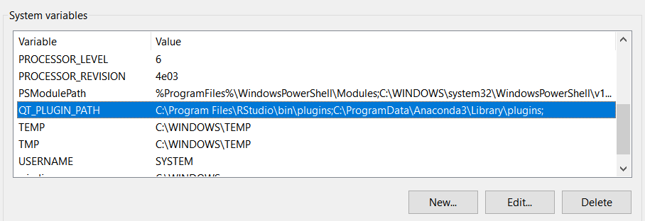
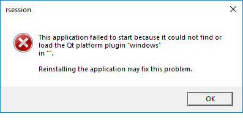
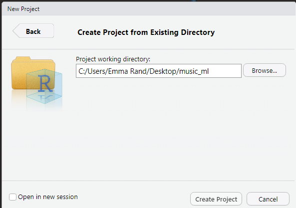
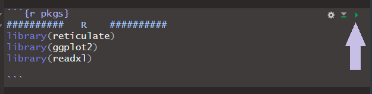

```{r setup, include=FALSE}
knitr::opts_chunk$set(echo = TRUE, 
                      message = FALSE,	
                      warning = FALSE)
options(htmltools.dir.version = FALSE)

```

background-image: url(pics/useR2019.png)
background-position: 4% 0%
background-size: 250px


class: inverse, right, bottom

# Keeping an exotic pet in your home!
## Taming Python to live in RStudio because<br>sometimes the best language is both!
<br>
### Emma Rand<br>emma.rand@york.ac.uk<br><br>Materials:   https://github.com/3mmaRand/useR2019_tutorial


---
class: center, middle

# But first.....Who am I? <br> and some Thank yous!

.footnote[
Materials:   https://github.com/3mmaRand/useR2019_tutorial
]
---


# Who I am?

.pull-left[


]

.pull-right[

Lecturer (Assistant Professor), Department of Biology University of York, UK

I'm a biologist by training. 

Long time R user, relatively new to Python. 
<br>
<br>
<br>
<br>
`r emo::ji("arrow_left")` York, twinned with Dijon.

.footnote[
Materials:   https://github.com/3mmaRand/useR2019_tutorial
]
]

---
background-image: url(pics/member_institute_logos.png)
background-position: 95% 7%

# Thank yous!

## To the local organisation committee
<small>
* Nathalie Vialaneix (chair), MIAT, INRA  
* Sébastien Déjean (vice-chair), Institut de Mathématiques de Toulouse, Université Toulouse 3 Paul Sabatier  
* Anne Ruiz-Gazen (vice-chair), Toulouse School of Economics, Université Toulouse 1 Capitole  
* Heather Turner (vice-chair), statistical consultant and associate fellow of the Statistics Department at the University of Warwick  
* Aurore Archimbaud, Toulouse School of Economics  
* Christophe Bontemps, Toulouse School of Economics, INRA  
* Robert Faivre, MIAT, INRA  
* Xavier Gendre, Institut de Mathématiques de Toulouse, Université Toulouse 3 Paul Sabatier  
* Thibault Laurent, Toulouse School of Economics, CNRS  
* Élise Maigné, Observatoire du Développement Rural, INRA  
* Pierre Neuvial, Institut de Mathématiques de Toulouse, CNRS  
* Rémi Servien, InTheRes, INRA  
* Matthias Zytnicki, MIAT, INRA  
</small>
.footnote[
Materials:   https://github.com/3mmaRand/useR2019_tutorial
]
---
# Thank yous! 

## For funding

.pull-left[
To the organisers and their sponsers


]

.pull-right[


My institution  


]

.footnote[
Materials:   https://github.com/3mmaRand/useR2019_tutorial
]
---
background-image: url(pics/leila.jpg)
background-position: 90% 50%
background-size: 400px
# Thank yous! 

## Leila Khajavi

.pull-left[

Leila is an American pursuing her PhD in Bioinformatics here in Toulouse, affiliated with both MIAT (INRA) and CPTP (INSERM).

She is very kindly giving her time here today to help out and has already contributed to the session by going through the material and giving some feedback.

But any errors that remain are mine!

]


.footnote[
Materials:   https://github.com/3mmaRand/useR2019_tutorial
]

---

# Thank yous! 
My colleagues at the University of York allowed me to practice on them:  
James Chong  
Bryden Fields  
Martina Stoycheva  
Jack Law  
Oliver Noble   
Rebecca Hall  
Evie Farnham  
Mike Gray  

.footnote[
Materials:   https://github.com/3mmaRand/useR2019_tutorial
]
--

And finally...

--


## Everyone here for coming! `r emo::ji("smile")`

---

<iframe src="https://docs.google.com/forms/d/e/1FAIpQLSdHXFrhsSfUXEyIhHAnP40fH5a66eRZm3YZaEcNFT-F08CKjA/viewform?embedded=true" width="640" height="650" frameborder="0" marginheight="0" marginwidth="0">Loading...</iframe>


---
background-image: url(https://upload.wikimedia.org/wikipedia/commons/f/f8/Python_logo_and_wordmark.svg)
background-position: 95% 95%
background-size: 250px

# Why `reticulate`?

You finally found the **perfect** solution to a data problem!

`r emo::ji("grin")`

.footnote[
Materials:   https://github.com/3mmaRand/useR2019_tutorial
]
--

but it's written in Python  

`r emo::ji("grimace")`  

--

You're collaborating with some great people  

`r emo::ji("grin")`  

--

but they mainly use Python!  

`r emo::ji("grimace")`

You want to use existing/available solutions and collaborate more easily.

---
# Why `reticulate`?

You could move to the darkside `r emo::ji("snake")`...

--

But you're familiar `r emo::ji("blue heart")` with R...


.footnote[
Materials:   https://github.com/3mmaRand/useR2019_tutorial
]
---

# Why `reticulate`?

But you're familiar with R  
**and very at home in RStudio...**  
&nbsp;  
&nbsp;  
&nbsp;  


.footnote[
Materials:   https://github.com/3mmaRand/useR2019_tutorial
]

---
# Why `reticulate`?

But you're familiar with R  
and very at home in RStudio  
**because it's comfortable...**  
&nbsp;  
&nbsp;  


.footnote[
Materials:   https://github.com/3mmaRand/useR2019_tutorial
]
---
# Why `reticulate`?

But you're familiar with R  
and very at home in RStudio  
because it's comfortable  
**and has many tools you like...**  
&nbsp;  


.footnote[
Materials:   https://github.com/3mmaRand/useR2019_tutorial
]
---

# Why `reticulate`?

But you're familiar with R  
and very at home in RStudio  
because it's comfortable  
and has many tools you like  
**and the sun always shines!**  


.footnote[
Materials:   https://github.com/3mmaRand/useR2019_tutorial
]

---
# Why `reticulate`?

So even though Python has some great tools...  
&nbsp;  
&nbsp;  
&nbsp;  
&nbsp;  


.footnote[
Materials:   https://github.com/3mmaRand/useR2019_tutorial
]

---
# Why `reticulate`?

So even though Python has some great tools  
**and some very cool people...**  
&nbsp;  
&nbsp;  
&nbsp;  


.footnote[
Materials:   https://github.com/3mmaRand/useR2019_tutorial
]

---
# Why `reticulate`?


So even though Python has some great tools  
and some very cool people  
**you don't want to move in!**  
&nbsp;  
&nbsp;  


.footnote[
Materials:   https://github.com/3mmaRand/useR2019_tutorial
]

---

# Why `reticulate`?

Thankfully, there's `Reticulate`

<small>JJ Allaire, Kevin Ushey and Yuan Tang (2018). reticulate: Interface to 'Python'. R package version  1.10. https://CRAN.R-project.org/package=reticulate </small> 

&nbsp;  


.footnote[
Materials:   https://github.com/3mmaRand/useR2019_tutorial
]

---

class: inverse, center, middle

# Tutorial Overview

---

# Tutorial Overview `r emo::ji("world_map")`

* Context: Very brief background to R `r emo::ji("blue heart")`and Python `r emo::ji("snake")`  

* Rationale: why use [Reticulate](https://rstudio.github.io/reticulate), what are its key features, how can it be used and set up  

* Background: A little Python. Only what you need to start making sense of calling Python from R  

* Using Python interactively with `repl_python()`  

* Integration in R markdown `r emo::ji("fountain_pen")`:  Writing your own `reticulate` tutorial
  * Part 1: Building your understanding
  * Part 2: Classifying audio segments  

What the tutorial won't be: a thorough introduction to Python, R Markdown or machine learning.

.footnote[
Materials:   https://github.com/3mmaRand/useR2019_tutorial
]
---

<iframe src="https://docs.google.com/forms/d/e/1FAIpQLSfFYrr2fN0fVRoKl0yvZUJSM3FwEZuO3ZzKLfqXtT6XvJumvQ/viewform?embedded=true" width="640" height="600" frameborder="0" marginheight="0" marginwidth="0">Loading...</iframe>

---
# Aims

This tutorial was designed for:  
* beginner to intermediate R users  
* those with little to no experience of Python  
* those who may not have experience of Rmarkdown  

--

By the end of the tutorial you should be able to:
* pass objects between simultaneous R and Python sessions  
* use Python methods in R code
* incorporate Python snippets in to your R workflow even if you don't understand in detail how they work

As long as you know what the Python methods and code snippets are for, and have a good-enough understanding of their inputs and outputs, then you can use `reticulate`.

--

Some of the code is specifically designed to develop understanding of the integration rather than refect a workflow. The later section comprises an example workflow.

---
# Background

```{r table, echo=FALSE, paged.print=TRUE}

comparision <- data.frame(R = c("1995",
                                "Ihaka & Gentleman, Chambers",
                                "User-friendly data analysis and visualisation for 'non-programmers'",
                                "Statistics graduates,  Academics, data scientists",
                                "R Markdown, tidyverse"),
                          Python = c("1991",
                                     "van Rossum",
                                     "Object-oriented,
                                     Readable, general purpose programming language",
                                     "Computer Science graduates, Software engineers",
                                     "Integration with web aps, Unified Machine learning API"),
                          row.names = c("Released",
                                        "Author",
                                        "Purpose",
                                        "Users most likely to be",
                                        "Features"))

knitr::kable(comparision, 
             format = "html")

```

.footnote[
Materials:   https://github.com/3mmaRand/useR2019_tutorial
]
---

# Why use Reticulate

## Speed up your workflow

* Problem solving is the defining feature of a data scientist
* Language should be secondary
* Choice of language driven by early impressions of the data. Change in direction later means lost time in translating

## Facilitate collaboration

* Allows you to leverage the skills expertise of the whole team
* Solves the hardest problem in Data Science - People<sup>1</sup>. 
* Many Data Scientists know both and they are happier<sup>2</sup>

.footnote[
[1] Mangano, 2019  
[2] Stack Overflow Developers' Survey, NanoMathius, 2018  
]


---
# Reticulate

## Key features

1. Ability to call Python from R  

2. Translation between R objects and Python objects  
 
3. Flexible binding to different Python environments  


---
# Reticulate

## Alllows you to use Python in four ways:  

1. Interactively in the console: `repl_python()`  

2. Sourcing Python scripts  

3. Importing Python modules  

4. In R Markdown documents  

--

We will start with `repl_python()` to build our understanding.

Then use R Markdown.

---
# Reticulate

## Ingredients

You will need

* [RStudio 1.2](https://www.rstudio.com/products/rstudio/)  
   1.2 is needed for some of the most useful features

--

* Python  
  [Anaconda 3](https://www.anaconda.com/distribution/) 
    recommended for data science, includes many useful libraries.

--

* The `reticulate` package. I recommend  using the development version
   ```{r eval=FALSE}
   devtools::install_github("rstudio/reticulate")  
   ```

.centre[

]


---
background-image: url(https://upload.wikimedia.org/wikipedia/en/c/cd/Anaconda_Logo.png)
background-position: 10% 30%
background-size: 280px

# This one

--

.pull-right[
 

**Not this one**
]


---

# Reticulate

## You will also need


*  Any other Python modules your Python code depends on (not needed here)

--

* Probably / possibly.....to set to the QT_PLUGIN_PATH environment variable.  

  In windows: Control Panel -> System and Security -> System then

  Advanced System settings -> Environment variables

  I have set mine to:
  
  `C:\Program Files\RStudio\bin\plugins; C:\ProgramData\Anaconda3\Library\plugins`


.footnote[
If you can describe and resolve in a better but still minimal way, please get in touch!
]
---

# Reticulate

## In windows: QT_PLUGIN_PATH environment variable



---
# Reticulate

## In windows: QT_PLUGIN_PATH environment variable

If you get this error: 

.pull-left[
**This application has failed to start because it could not find or load the qt platform plugin "windows" in "" **
]

.pull-right[

]

Setting the QT_PLUGIN_PATH environment variable as on the previous slide should fix it.

.footnote[
If you can describe and resolve in a better but still minimal way, please get in touch!
]

---

class: inverse, center, middle

# A little Python

---
background-image: url(pics/cute-snake.jpg)
background-position: 95% 7%


# Python fundamentals
Suppose you wanted to created an array of 5 numbers. 

In R you might do this as:
```{r eval=FALSE}
r_array <- c(4, 5, 1, 6, 8)
```

--
In Python you might use a list<sup>1</sup>

A list is created like this:
```{python eval=FALSE}
python_list = [4, 5, 1, 6, 8]
```


.footnote[
[1] Python doesn't have a native array data structure
]

--

Python uses `=` for assignment

--

The square brackets denote a list
---
background-image: url(pics/cute-snake.jpg)
background-position: 95% 7%

# Python fundamentals

But lists do not behave as a R user might expect.

For example, what would you expect the output to be?

```{python eval=FALSE}
python_list = [4, 5, 1, 6, 8]
*python_list * 2
```

--

This?
```{python eval=FALSE}
python_list = [4, 5, 1, 6, 8]
python_list * 2
*[4, 10, 2, 12, 16]
```

--
Infact it is this:
```{python eval=FALSE}
python_list = [4, 5, 1, 6, 8]
python_list * 2
*[4, 5, 1, 6, 8, 4, 5, 1, 6, 8]
```


`r emo::ji("shocked")`

---
background-image: url(pics/cute-snake.jpg)
background-position: 95% 7%

# Python fundamentals

Instead you might use the [NumPy package](http://www.numpy.org/)<sup>1</sup>. NumPy arrays behave like R vectors/arrays.

.footnote[
[1] NumPy is the fundamental package for scientific computing with Python. It is part of the 
SciPy ecosystem.  
Jones E, Oliphant E, Peterson P, et al. SciPy: Open Source Scientific Tools for Python, 2001-, http://www.scipy.org/.
]
--

To make a NumPy array we need to first`import` NumPy, then use it's `array()` function. 

This is going to introduce us to several Pythonesque things.

---
background-image: url(pics/cute-snake.jpg)
background-position: 95% 7%


# Python fundamentals


The Python code looks like this:
```{python eval=FALSE}
import numpy as np
python_array = np.array([4, 5, 1, 6, 8])
```

---
background-image: url(pics/cute-snake.jpg)
background-position: 95% 7%


# Python fundamentals


The Python code looks like this:
```{python eval=FALSE}
*import numpy as np
python_array = np.array([4, 5, 1, 6, 8])
```


`import` in Python is the equivalent of `library()` in R

--

To use methods in NumPy (and other modules) we need to use the "dot" notation:

`numpy.method_name()`

To make this quicker to type it is common to use an alias. That's the `as np` bit

---
background-image: url(pics/cute-snake.jpg)
background-position: 95% 7%

# Python fundamentals

```{python eval=FALSE}
import numpy as np
*python_array = np.array([4, 5, 1, 6, 8])
```

The second line of code creates the numpy array (from a list).

--

To do things with `python_array` we might use a built-in function. These are used in a way that will be familar to you, for example:

```{python eval=FALSE}
type(python_array)
<class 'numpy.ndarray'>
```
  
--

Python also has methods. Methods are called on objects with the dot notation.  
For example:

```{python eval=FALSE}
python_array.max()
8
```
---

class: center, middle

# Enough!<br> <br>Let me code

## We will cover some more Python as we go through the tutorial.
---

class: inverse, center, middle

# Using Python in the console
## `reticulate::repl_python()`
---

# Using Python in the console

## Steps

We are going to use Python interactively in the console.  

We will 
* Create a new project  
* Check our Python environment  
* Start a Python session from our R session  
* Create a NumPy array  
* Use the NumPy array  
  * find its size (an attribute)   
  * calculate its mean (a method)  
* End the Python session  
* Access the NumPy array from our R session  

.footnote[
`r kableExtra::text_spec("Extra exercise", background = "purple", color = "white", bold = TRUE)` Indicates an optional extra exercise to try while you're waiting for me to move on.
]

---
# Using Python in the console

## Organising ourselves

.pull-left[
We are going to work in a project<sup>1</sup>.

File | New Project | Existing Directory

Choose Browse

And navigate to the "music_ml" folder and Open
]

.pull-right[


]

Choose Create Project

.footnote[
[1] New to projects? [RStudio: Using Projects](https://support.rstudio.com/hc/en-us/articles/200526207-Using-Projects)
]


---
background-image: url(pics/reticulated_python.png)
background-position: 95% 7%

# Using Python in the console

We are going to be moving between Python and R sessions.

Which could get confusing!

--

What session you are in **at the start of a slide** is indicated like this:

.pull-left[

## `r emo::ji("snake")` _Sub-heading_
You are working interactively with python and your prompt should look like this: 
```{r eval=FALSE}
>>>
```
You may **finish** the slide in an R session
]

--
.pull-right[

## `r emo::ji("blue heart")` _Sub-heading_
You are working interactively with R and your prompt should look like this:
```{r eval=FALSE}
>
```
You may **finish** the slide in a Python session
]


---
background-image: url(pics/reticulated_python.png)
background-position: 95% 7%

# Using Python in the console

## `r emo::ji("blue heart")` Prepare to start a Python session

Load the reticulate package
```{r eval=FALSE}
> library(reticulate)
```

For this section on using `repl_python()` I will show the prompt, either `>` or`>>>` in the code.

---
background-image: url(pics/reticulated_python.png)
background-position: 95% 7%

# Using Python in the console

## `r emo::ji("blue heart")` Start a Python session

With `repl_python()`:

```{r eval=FALSE}
>  repl_python() 
Python 3.7.3 (C:\PROGRA~3\ANACON~1\python.exe)
Reticulate 1.12.0.9003 REPL -- A Python interpreter in R
>>>  
```

---
background-image: url(pics/reticulated_python.png)
background-position: 95% 7%

# Using Python in the console

## `r emo::ji("snake")` repl_python()

```{r eval=FALSE}
>  repl_python() 
*Python 3.7.3 (C:\PROGRA~3\ANACON~1\python.exe)
*Reticulate 1.12.0.9003 REPL -- A Python interpreter in R
>>>  
```

* You get a message to tell you what version of Python you're using and where it is  

---
background-image: url(pics/reticulated_python.png)
background-position: 95% 7%

# Using Python in the console

## `r emo::ji("snake")` repl_python()

```{r eval=FALSE}
>  repl_python() 
Python 3.7.3 (C:\PROGRA~3\ANACON~1\python.exe)
Reticulate 1.12.0.9003 REPL -- A Python interpreter in R
*>>>  
```

* You get a message to tell you what version of Python you're using and where it is.  

* `>>>` indicates the Python prompt.  

--

We need to use Python 3.

By default, `reticulate` uses the version of Python found on your PATH. 

--

If Python 3 is not being used (possibly Mac users) we can change it.

---
background-image: url(pics/reticulated_python.png)
background-position: 95% 7%

# Using Python in the console

## `r emo::ji("snake")` Change the Python version

End the `repl_python` session:

```{r eval=FALSE}
>>> exit
>
```

--
## `r emo::ji("blue heart")` 

Set the version of Python you want to use. 

This needs to be where Anaconda3 installed. In my case:

```{r eval=FALSE}
> use_python("C:/ProgramData/Anaconda3/python.exe")
```

---
background-image: url(pics/reticulated_python.png)
background-position: 95% 7%

# Using Python in the console

## `r emo::ji("blue heart")` Check the Python version

Confirm it has been set:

```{r eval=FALSE}
> Sys.which("python")
                              python 
"C:\\PROGRA~3\\ANACON~1\\python.exe" 
```

On windows machines the paths will be short paths (8+3 components, no spaces) with \ as the path delimiter. 

In my case, it is short for `C:/ProgramData/Anaconda3/python.exe`

So I know I'm using Python 3

---
background-image: url(pics/reticulated_python.png)
background-position: 95% 7%

# Using Python in the console

## `r emo::ji("snake")` Make a NumPy array


Import the [NumPy package](http://www.numpy.org/)
.pull-left[
```{r eval=FALSE}
>>> import numpy as np
>>> 
```
]

.pull-right[
You get command completion!
]

.footnote[
`r kableExtra::text_spec("Extra exercise 1.", background = "purple", color = "white", bold = TRUE)` Create a list called `python_list`  
`r kableExtra::text_spec("Extra exercise 2.", background = "purple", color = "white", bold = TRUE)` Import pandas and create a small data frame. You'll need the DataFrame() method from pandas. As arguments, it will take lists of lists the same length
]

--

and create an array in the console
```{r eval=FALSE}
>>> python_array = np.array([4, 5, 1, 6, 8])
>>> 
```
--

#### Success! `r emo::ji("sparkler")` 

---
background-image: url(pics/reticulated_python.png)
background-position: 95% 7%

# Using Python in the console

## Oh! `r emo::ji("confused")`
But nothing appears in your R environment!
  


.footnote[
`r kableExtra::text_spec("Extra exercise 1.", background = "purple", color = "white", bold = TRUE)` Create a list called `python_list`  
`r kableExtra::text_spec("Extra exercise 2.", background = "purple", color = "white", bold = TRUE)` Import pandas and create a small data frame. You'll need the DataFrame() method from pandas. As arguments, it will take lists of lists the same length
]

---
background-image: url(pics/reticulated_python.png)
background-position: 95% 7%

# Using Python in the console

## `r emo::ji("snake")` Where is our NumPy array?
Can Python can find it? 
####`r emo::ji("search")`

.footnote[  
`r kableExtra::text_spec("Extra exercise 3.", background = "purple", color = "white", bold = TRUE)` How do you need to organise the list of lists in the DataFrame() command to get a 4 rows and 2 columns compared to 2 rows and 4 columns.
]

--

```{r eval=FALSE}
>>> python_array
array([4, 5, 1, 6, 8])
>>>
```
--
#### `r emo::ji("thumbs up")` `r emo::ji("hooray")`

Great, the Python session can see it!


---
background-image: url(pics/reticulated_python.png)
background-position: 95% 7%

# Using Python in the console

## `r emo::ji("snake")` Work with a NumPy array

Check the object type of `python_array`:

```{r eval=FALSE}
>>> type(python_array)
<class 'numpy.ndarray'>
>>> 
```

--

Find the size of `python_array` with:

```{r eval=FALSE}
>>> python_array.size
5
>>>
```

.footnote[
`r kableExtra::text_spec("Extra exercise 4.", background = "purple", color = "white", bold = TRUE)` What does `.size` give for the the list and dataframe? Try `.shape`
]

--

`size` is an *attribute* or *value* of NumPy arrays. 

---
background-image: url(pics/reticulated_python.png)
background-position: 95% 7%

# Using Python in the console


## `r emo::ji("snake")`Work with a NumPy array

Can you find the mean of `python_array`
.footnote[
`r kableExtra::text_spec("Extra exercise 5.", background = "purple", color = "white", bold = TRUE)` Find other summary statistics for the array  
`r kableExtra::text_spec("Extra exercise 6.", background = "purple", color = "white", bold = TRUE)` Is there a mean method for the dataframe? What about the list? Can you find the mean of your list?
]
--

```{r eval=FALSE}
>>> python_array.mean()
4.8
>>>
```
`mean()` is an *method* of NumPy arrays.

---
background-image: url(pics/reticulated_python.png)
background-position: 95% 7%

# Using Python in the console

## `r emo::ji("snake")` Bye bye Python

Let's exit Python
```{r eval=FALSE}
>>> exit
>
```

---
background-image: url(pics/reticulated_python.png)
background-position: 95% 7%

# Using Python in the console

## `r emo::ji("blue heart")` Hello R

&nbsp;

```{r eval=FALSE}
>>> exit
*>
```

The R prompt is returned
---
background-image: url(pics/reticulated_python.png)
background-position: 95% 7%

# Using Python in the console

## `r emo::ji("blue heart")` Now where is `python_array`?

.pull-left[
 
]

.pull-right[
Our environment is still empty
]

--

But we **can** access the Python object using `py$...`

```{r eval=FALSE}
> py$python_array
[1] 4 5 1 6 8
```

.footnote[
`r kableExtra::text_spec("Extra exercise 7.", background = "purple", color = "white", bold = TRUE)` Can you access the list and dataframe?
]

---
background-image: url(pics/reticulated_python.png)
background-position: 95% 7%

# Using Python in the console

## `r emo::ji("blue heart")` Accessing python-created objects

And we have normal command completion so typing `py$` followed by the TAB key ⭾ will list the available python objects.


--

Notice we have more than `python_array`. 

We will return to this in a few slides.

---
background-image: url(pics/reticulated_python.png)
background-position: 95% 7%

# Using Python in the console

## `r emo::ji("blue heart")` Accessing python-created objects

`reticulate` makes these python-created objects behave how you expect them to in R.

```{r eval=FALSE}
> py$python_array * 2
[1]  8 10  2 12 16
```

```{r eval=FALSE}
> py$python_array * py$python_array
[1] 16 25  1 36 64
```

.footnote[  
`r kableExtra::text_spec("Extra exercise 8.", background = "purple", color = "white", bold = TRUE)` How do the list and dataframe behave? 
]

---
background-image: url(pics/reticulated_python.png)
background-position: 95% 7%

# Using Python in the console

## `r emo::ji("blue heart")` R functions on python-created objects

They behave the way you expect them to because they are converted R objects
when used!

```{r eval=FALSE}
> class(py$python_array)
[1] "array"
```
`py$python_array` is a one-dimensional array

numpy.ndarray $\rightarrow$ array

And look! `r emo::ji("look")`
We can use R functions on python-created objects

.footnote[   
`r kableExtra::text_spec("Extra exercise 9.", background = "purple", color = "white", bold = TRUE)` What is the object translation for the list and dataframe object is it?
]
---
background-image: url(pics/reticulated_python.png)
background-position: 95% 7%

# Using Python in the console

## `r emo::ji("blue heart")` R functions on python-created objects

The mean...

```{r eval=FALSE}
> mean(py$python_array)
[1] 4.8
```
... and length of the array
```{r eval=FALSE}
> length(py$python_array)
[1] 5
```


---
background-image: url(pics/reticulated_python.png)
background-position: 95% 7%

# Using Python in the console

## `r emo::ji("blue heart")` R functions on python-created objects

You can assign the python object explicitly

```{r eval=FALSE}
> r_array <- py$python_array
```


---
background-image: url(pics/reticulated_python.png)
background-position: 95% 7%

# Using Python in the console

## `r emo::ji("blue heart")` Python methods on python-created objects

Remember this?


We have access to the `np` object which results from importing `NumPy` as `np` in our Python session.

This gives us access to all the NumPy attributes and methods.


---
background-image: url(pics/reticulated_python.png)
background-position: 95% 7%

# Using Python in the console

## `r emo::ji("blue heart")` Python methods on python-created objects

.pull-left[

`r emo::ji("snake")` In Python `np` attributes are applied by following the object with a dot: 

_`object_name.attribute_name`_

For example, we found the size of `python_array` with:

```{r eval=FALSE}
>>> python_array.size
5
```
]
.footnote[   
`r kableExtra::text_spec("Extra exercise 10.", background = "purple", color = "white", bold = TRUE)` Create a vector, array and/or dataframe in R then restart `repl_python()` and access them in the Python session with `r.` 
]
--
.pull-right[

`r emo::ji("blue heart")` In R we access and apply `np` attributes in a R like way: 

`py$np$` _`attribute_name(object_name)`_

So to use the size attribute on `py$python_array`:

```{r eval=FALSE}
> py$np$size(py$python_array)
[1] 5
```
]

--
 
**This would be a strange thing to do!** 
---

background-image: url(pics/reticulated_python.png)
background-position: 95% 7%

# Using Python in the console

## Why strange??

Because if you already have a python-created object on which you wanted to use some Python methods before doing further work in R, you would more naturally

* Use those methods in Python in a Python way  
* Then access the result in R for further work  

.footnote[   
`r kableExtra::text_spec("Extra exercise 11.", background = "purple", color = "white", bold = TRUE)` In your `repl_python` session, apply R functions to the  data structures made in the R session 
]
--

Than
* access the object in R
* apply python methods to a python object in an R-like way in an R session
* Then do your further work


---
class: inverse, center, middle

# How: Using Python in R Markdown

## 

---
background-image: url(pics/reticulated_python.png)
background-position: 95% 7%

# How: Using Python in R Markdown

## Aim

You are going to write your own `reticulate` tutorial by combining your own notes and investigations with the code given in the slides.

--

The tutorial will be in two parts:
* The first part of the tutorial aims to develop our baseline understanding of the link between the R and Python sessions and running code chunks interactively. We will pass simple objects between sessions more than you would normally just for demomstration purposes

--

* The second part covers the importing, modelling and visualisation of processed audio data.

--

The tutorial is "Classification of Audio segments by instrument: A Tutorial on using the R package reticulate to integrate R and Python."

You are aiming for something like this: [Classifiying_music.html](music_ml/Classifiying_music.html)

---
background-image: url(pics/reticulated_python.png)
background-position: 95% 7%

# How: Using Python in R Markdown

## The data

We are going to work with some data derived from 9 pieces of music. Three examples are:

* [Chopin - Ballade No. 1 in G Minor](https://www.youtube.com/watch?v=Zj_psrTUW_w) 
* [Corelli - Sonata da Chiesa, Op. 1 No. 1 in F major](https://www.youtube.com/watch?v=0fLbzkBRywU)
* [Mozart - Sonata in F major for piano and violin K 376](https://www.youtube.com/watch?v=iOq_lZWD8Lg)

--

The example and the original Python code to process the audio files and carry out the machine learning analysis methods are by Michael Knight, University of Bristol. 

--

Each of the pieces of music has been segmented into 5-second segments each of which has 5000 features. The features represent the apodised power spectrum of a 5-second segment. 

We will try to classify these segments.  


---
background-image: url(pics/reticulated_python.png)
background-position: 95% 7%

# How: Using Python in R Markdown

## The data

Up to 100 segments were taken from each audio file although there are fewer for pieces shorter than 500 seconds.

```{r echo=FALSE}
datasummary <- read.table("music_ml/datasummary.txt", header = T, sep= ",")

tab <- knitr::kable(datasummary[1:3], 
             format = "html",
             col.names = c("Instrument", "Piece", "Number of segments"),
             row.names = FALSE) 
kableExtra::kable_styling(tab,font_size = 13)
```

---
background-image: url(pics/reticulated_python.png)
background-position: 95% 7%

# How: Using Python in R Markdown

## The data

There are two xlsx files for each piece.

* *name*_segments.xlsx  
  has the segments in rows and the features in columns
* *name*_SegmentInfo.xlsx  
  has the metadata for each segment: the name of the piece, the instrument label on the piece, the start and end time of the segment.  

--

There are `r sum(datasummary$Freq)` segments in total of which `r sum(datasummary$Freq[datasummary$Type == "Piano"])` are from piano pieces and `r sum(datasummary$Freq[datasummary$Type == "Violin"])` are from violin pieces. The remaining `r sum(datasummary$Freq[datasummary$Type == "Violin and Piano"])` pieces are from Mozart's  Sonata piano and violin.


---
background-image: url(pics/rmarkdown.png)
background-position: 95% 5%
background-size: 100px

# How: Using Python in R Markdown

## What is R Markdown

### Live demo
May not be needed depending on the audience responses from earlier.


Just watch for a while....

---

background-image: url(pics/rmarkdown.png)
background-position: 95% 5%
background-size: 100px

# How: Using Python in R Markdown

## What is R Markdown

### Key points from the demo

* blends narative text with analysis code and output  
* human readable  
* YAML header between the  \-\-\-
* code chunk options control whether the code and its output end up in your 'knitted' document  
* comments   
  * in a code chunk the \# is still used for comments  
  * in the text a comment is written like this  <!\-\- a comment \-\->
  * but use Ctrl+Shift+C  
* \# in the text indicate headings  


---
background-image: url(pics/reticulated_python.png)
background-position: 95% 7%

# How: Using Python in R Markdown

## Make your own R markdown doc

File | New File | R Markdown

--

Delete everything except:  
* the YAML header between the  \-\-\-  
* the first code chunk which begins:  
  ` ```{r setup, include=FALSE} `

--

Add your name, and a title 

You could copy and paste a title from [Classifiying_music.html](music_ml/Classifiying_music.html)

---
background-image: url(pics/reticulated_python.png)
background-position: 95% 7%

# How: Using Python in R Markdown

## Set up your default code chunk behaviour

That first code chunk is for setting some **default** code chunk options. 

I often use these:


````
```{r setup, include=FALSE}`r ''`
knitr::opts_chunk$set(echo = FALSE, 
                      warning = FALSE,
                      message = FALSE)
```
````
--

`echo = FALSE` means the code will not be included by default - this is normally what you want in a report.

--

However, I used `echo = TRUE` in [Classifiying_music.Rmd](music_ml/Classifiying_music.Rmd) so you could see the code.

Any output is included by default
 
---
background-image: url(pics/reticulated_python.png)
background-position: 95% 7%

# How: Using Python in R Markdown

## Start adding some text

Add a little introduction.  

You can make your own notes or copy and paste from [Classifiying_music.html](music_ml/Classifiying_music.html)  

**Save your file**

---
background-image: url(pics/reticulated_python.png)
background-position: 95% 7%

# How: Using Python in R Markdown

## Add an R chunk

The second code chunk in an Rmd document typically loads the required packages.

--

There's one package you will definitely need: `reticulate`

We also also use `readxl`<sup>1</sup> and `ggplot2`<sup>2</sup> so let's add those too:

.footnote[
[1] Wickham, H. Bryan, J. (2019). readxl: Read Excel Files. R package version 1.3.1. https://CRAN.R-project.org/package=readxl  
[2] Wickham, H. (2016) ggplot2: Elegant Graphics for Data Analysis. Springer-Verlag New York https://ggplot2.tidyverse.org
]
--
.pull-left[

````
```{r pkgs}`r ''`
##########   R    ##########
library(reticulate)
library(readxl)
library(ggplot2)
```
````
]

.pull-right[
Use Insert | R to add a code chunk. From now on 
.pull-left[
`r kableExtra::text_spec("Insert R chunk", background = "deepskyblue", bold = TRUE, color = "black")`
]
.pull-right[
`r kableExtra::text_spec("Insert Python chunk", background = "greenyellow", bold = TRUE, color = "black")`
]
]


---
background-image: url(pics/reticulated_python.png)
background-position: 95% 7%

# How: Using Python in R Markdown

## Run a R chunk!

To run R commands interactively in a R Markdown document we need to run this code chunk.

Use the green arrow on the right of the chunk to run it.



From now on 

`r kableExtra::text_spec("=> Run", background = "lavender", bold = TRUE, color = "black")`

means use the green button to run the chunk.

---
background-image: url(pics/reticulated_python.png)
background-position: 95% 7%

# How: Using Python in R Markdown

## Add a Python chunk

Now we'll add a chunk to import the Python modules we will need.

In Part 1, we will use the os module

--

.pull-left[
`r kableExtra::text_spec("Insert Python chunk", background = "greenyellow", bold = TRUE, color = "black")`
````
```{python mods}`r ''`
########## PYTHON ##########
import os
```
````

]
.pull-right[

`r kableExtra::text_spec("=> Run", background = "lavender", bold = TRUE, color = "black")`
]

--

To use `os` methods interactively in later Python code chunks be sure to run this code chunk.

--

We will add any other Python modules we need later.

---
background-image: url(pics/reticulated_python.png)
background-position: 95% 7%

# How: Using Python in R Markdown

## Part 1 Building our understanding

If you get the error:

This application has failed to start because it could not find or load the qt platform plugin "windows" in ""

You may need to check QT_PLUGIN_PATH (see earlier slide)

---
background-image: url(pics/reticulated_python.png)
background-position: 95% 7%

# How: Using Python in R Markdown

## Part 1 Building our understanding

You may want to add a header indicating this is Part 1 of the tutorial

--

A Python equivalent for R's `getwd()` is `getcwd()` from the `os` module.

--

If you have successfully imported the `os` module you can use it like this:


.pull-left[
`r kableExtra::text_spec("Insert Python chunk", background = "greenyellow", bold = TRUE, color = "black")`
````
```{python}`r ''`
########## PYTHON ##########
os.getcwd()
```
 'C:\\Users\\Emma Rand\\Desktop\\useR2019\\useR2019_tutorial\\music_ml'
````
]
.pull-right[
`r kableExtra::text_spec("=> Run", background = "lavender", bold = TRUE, color = "black")`
]

--

It prints out! 

On a windows machine the 'windows-way' round slashes are escaped  
On a mac the path will be given 'correctly'


---
background-image: url(pics/reticulated_python.png)
background-position: 95% 7%

# How: Using Python in R Markdown

## Part 1 Building our understanding

We can also use the the `getcwd()` method from `os` in a R chunk.

--

Remember, to access Python objects (of any sort) in R we use `py$`

Here we access the `os` object's methods 

--

BUT in a R-like way using the `$` not a `.`

.pull-left[
`r kableExtra::text_spec("Insert R chunk", background = "deepskyblue", bold = TRUE, color = "black")`
````
```{r}`r ''`
##########   R    ##########
py$os$getcwd()

```
 [1] "C:\\Users\\Emma Rand\\Desktop\\useR2019\\useR2019_tutorial\\music_ml"
````
]
.pull-right[

`r kableExtra::text_spec("=> Run", background = "lavender", bold = TRUE, color = "black")`
]

---
background-image: url(pics/reticulated_python.png)
background-position: 95% 7%

# How: Using Python in R Markdown

## Part 1 Building our understanding

And we access R functions in Python chunks in a Python-like way

Can you do that? 

--

.pull-left[
`r kableExtra::text_spec("Insert Python chunk", background = "greenyellow", bold = TRUE, color = "black")`
````
```{python}`r ''`
########## PYTHON ##########
r.getwd()
```
 'C:/Users/Emma Rand/Desktop/useR2019/useR2019_tutorial/music_ml'
````
]
.pull-right[

`r kableExtra::text_spec("=> Run", background = "lavender", bold = TRUE, color = "black")`
]


That's right! Though I'm not sure quite why you would!

--

`r emo::ji("look")` You might have noticed that the output of Python chunks doesn't include the element numbering [1] characteristic of R output.

---
background-image: url(pics/reticulated_python.png)
background-position: 95% 7%

# How: Using Python in R Markdown

## Part 1 Building our understanding

We will read one of the spectrum files to learn how to access dataframes in both sessions using `read_excel()` from `readxl`:


.pull-left[
`r kableExtra::text_spec("Insert R chunk", background = "deepskyblue", bold = TRUE, color = "black")`
````
```{r}`r ''`
##########   R    ##########
spectrum <- read_excel("Piano/01 Ballade No. 1, Op. 23_segments.xlsx")
```
````

]
.pull-right[

`r kableExtra::text_spec("=> Run", background = "lavender", bold = TRUE, color = "black")`
]

--

Check the dimensions of the dataframe

---
background-image: url(pics/reticulated_python.png)
background-position: 95% 7%

# How: Using Python in R Markdown

## Part 1 Building our understanding


.pull-left[
`r kableExtra::text_spec("Modify R Chunk", background = "deepskyblue", bold = TRUE, color = "black")`
````
```{r}`r ''`
##########   R    ##########
spectrum <- read_excel("Piano/01 Ballade No. 1, Op. 23_segments.xlsx")
dim(spectrum)
```
[1] 100 5001
````

]
.pull-right[

`r kableExtra::text_spec("=> Run", background = "lavender", bold = TRUE, color = "black")`
]

---
background-image: url(pics/reticulated_python.png)
background-position: 95% 7%

# How: Using Python in R Markdown

## Part 1 Building our understanding

Can you use the `r emo::ji("snake")` Pandas method `shape` in a new python chunk to achieve the same thing?

--

   Hint: the dataframe is `r.spectrum`

--

.pull-left[
`r kableExtra::text_spec("Insert Python chunk", background = "greenyellow", bold = TRUE, color = "black")`

````
```{python}`r ''`
########## PYTHON ##########
r.spectrum.shape
```
(100, 5001)
````

]
.pull-right[

`r kableExtra::text_spec("=> Run", background = "lavender", bold = TRUE, color = "black")`
]

That's right!

---
background-image: url(pics/reticulated_python.png)
background-position: 95% 7%

# How: Using Python in R Markdown

## Part 1 Building our understanding

* 100 rows _i.e._, segments. 
* 5001 columns. The first column, "...1" is the segment label; the others are the 5000 features. They have the names "0" to "4999"

Using R to find the mean and s.d. of the second feature<sup>1</sup>

.footnote[
[1] There's nothing specials about feature 2. I'm avoiding the first feature simply because it is atypical
]

--


.pull-left[
`r kableExtra::text_spec("Insert R Chunk", background = "deepskyblue", bold = TRUE, color = "black")`
````
```{r}`r ''`
##########   R    ##########
mean(spectrum$`1`)
sd(spectrum$`1`)
```
[1] 4422.34
[1] 5711.785
````

]
.pull-right[

`r kableExtra::text_spec("=> Run", background = "lavender", bold = TRUE, color = "black")`
]


---
background-image: url(pics/reticulated_python.png)
background-position: 95% 7%

# How: Using Python in R Markdown

## Part 1 Building our understanding

Can you use Python to achieve the same:

--

.pull-left[
`r kableExtra::text_spec("Insert Python Chunk", background = "greenyellow", bold = TRUE, color = "black")`
````
```{python}`r ''`
########## PYTHON ##########
r.spectrum["1"].mean()
r.spectrum["1"].std()
```
4422.34
5711.784974979717
````

]
.pull-right[

`r kableExtra::text_spec("=> Run", background = "lavender", bold = TRUE, color = "black")`
]

Well done!

---
background-image: url(pics/reticulated_python.png)
background-position: 95% 7%

# How: Using Python in R Markdown

## Part 1 Building our understanding

### Knit your Rmd

Now is good time to hit knit!
---
background-image: url(pics/reticulated_python.png)
background-position: 95% 7%

# How: Using Python in R Markdown

## Part 1 Building our understanding

Now read in the same file using Python.

--

You'll need to first add the `Pandas`<sup>1</sup> module to your list of import statements in the Python chunk called mods

--

.pull-left[
`r kableExtra::text_spec("Modify Python Chunk", background = "greenyellow", bold = TRUE, color = "black")`
````
```{python mods}`r ''`
########## PYTHON ##########
import os
import pandas as pd
```
````

]
.pull-right[

`r kableExtra::text_spec("=> Run", background = "lavender", bold = TRUE, color = "black")`
]

.footnote[
[1] McKinney, W. (2010) Data Structures for Statistical Computing in Python, Proceedings of the 9th Python in Science Conference, 51-56 
]
---
background-image: url(pics/reticulated_python.png)
background-position: 95% 7%

# How: Using Python in R Markdown

## Part 1 Building our understanding

Read in the file:

.pull-left[
`r kableExtra::text_spec("Insert Python Chunk", background = "greenyellow", bold = TRUE, color = "black")`
````
```{python}`r ''`
########## PYTHON ##########
python_spectrum = pd.read_excel("Piano/01 Ballade No. 1, Op. 23_segments.xlsx")
```
````

]
.pull-right[

`r kableExtra::text_spec("=> Run", background = "lavender", bold = TRUE, color = "black")`
]


---
background-image: url(pics/reticulated_python.png)
background-position: 95% 7%

# How: Using Python in R Markdown

## Part 2 Classification of audio data

### Data import
This will be carried out with Python. 

**Overivew**  
The nine "_segments.xlsx" files are read in to a single Pandas dataframe, `df_seg`.

--

This requires nested `for` loops to iterate through the directories and through the files in the directories. 

The information about the segments in "_SegmentInfo.xlsx" files are similarly read into a Pandas dataframe, `df_info` and a column is added to capture the instrument labeling.

You should be able to use and run the Python code without understanding how it works.

---
background-image: url(pics/reticulated_python.png)
background-position: 95% 7%

# How: Using Python in R Markdown

## Part 2 Classification of audio data

### Data import
Copy the importing code from: [Classifiying_music.html](music_ml/Classifiying_music.html)

Insert a new Python chunk and paste the code in

.pull-left[
````
```{python}`r ''`
########## PYTHON ##########
dirs_to_use = ["Violin", "Piano", "Violin_and_Piano"]

df_seg = None
df_info = None
for d in dirs_to_use:
    for f in os.listdir(d):
    ... ... ...
    ... ... ... etc
    
```
````

]
.pull-right[

`r kableExtra::text_spec("=> Run", background = "lavender", bold = TRUE, color = "black")`
]

---
background-image: url(pics/reticulated_python.png)
background-position: 95% 7%

# How: Using Python in R Markdown

## Part 2 Classification of audio data

### Knit your Rmd

Now is good time to hit knit!

---
background-image: url(pics/reticulated_python.png)
background-position: 95% 7%

# How: Using Python in R Markdown

## Part 2 Classification of audio data

### Principal Component Analysis (PCA) in Python

You'll need to first PCA from the `scikit-learn`<sup>1</sup> module to your list of import statements in the Python chunk called mods

.footnote[
[1] Pedregosa et al. (2011) Scikit-learn: Machine Learning in Python. JMLR 12: 2825-2830 http://jmlr.csail.mit.edu/papers/v12/pedregosa11a.html
]
--

.pull-left[
````
```{python mods}`r ''`
########## PYTHON ##########
import os
import pandas as pd

# for PCA
from sklearn.decomposition.pca import PCA
```
````

]
.pull-right[

`r kableExtra::text_spec("=> Run", background = "lavender", bold = TRUE, color = "black")`
]


---
background-image: url(pics/reticulated_python.png)
background-position: 95% 7%

# How: Using Python in R Markdown

## Part 2: PCA in Python
The PCA is carried out with

.pull-left[
````
```{python}`r ''`
########## PYTHON ##########
# Apply PCA
mdl = PCA()
new_data = mdl.fit_transform(df_seg)
    
```
````

]
.pull-right[

`r kableExtra::text_spec("=> Run", background = "lavender", bold = TRUE, color = "black")`
]

`new_data` contains the Principle Component scores

---

background-image: url(pics/reticulated_python.png)
background-position: 95% 7%

# How: Using Python in R Markdown

## Part 2: Visualising the `r emo::ji("snake")` PCA

First using Python.

You'll need to first PCA from the `matplotlib.pyplot`<sup>1</sup> module to your list of import statements in the Python chunk called mods

.footnote[
[1] Pedregosa et al. (2011) Scikit-learn: Machine Learning in Python. JMLR 12: 2825-2830 http://jmlr.csail.mit.edu/papers/v12/pedregosa11a.html
]
--

.pull-left[
````
```{python mods}`r ''`
########## PYTHON ##########
import os
import pandas as pd

# for PCA
from sklearn.decomposition.pca import PCA
# for plotting
import matplotlib.pyplot as plt
```
````

]
.pull-right[

`r kableExtra::text_spec("=> Run", background = "lavender", bold = TRUE, color = "black")`
]

---
background-image: url(pics/reticulated_python.png)
background-position: 95% 7%

# How: Using Python in R Markdown

## Part 2: Visualising the `r emo::ji("snake")` PCA

First using Python

Copy the Biplot code from: [Classifiying_music.html](music_ml/Classifiying_music.html)

Insert a new Python chunk and paste the code in
.pull-left[
````
```{python}`r ''`
########## PYTHON ##########
p = df_info["Instrument"] == "Piano"
v = df_info["Instrument"] == "Violin"
pv = df_info["Instrument"] == "Violin_and_Piano"
plt.figure()
... ... ...
... ... ... etc
    
```
````

]
.pull-right[

`r kableExtra::text_spec("=> Run", background = "lavender", bold = TRUE, color = "black")`
]

You should see the Python plot in your file!

---
background-image: url(pics/reticulated_python.png)
background-position: 95% 7%

# How: Using Python in R Markdown

## Part 2: Visualising the `r emo::ji("snake")` PCA

### Knit your Rmd

---
background-image: url(pics/reticulated_python.png)
background-position: 95% 7%

# How: Using Python in R Markdown

## Part 2: Visualising the `r emo::ji("snake")` PCA

Now using R!

Insert a new R chunk: 
.pull-left[
````
```{r}`r ''`
##########   R    ##########
df <- data.frame(pca1 = py$new_data[ ,1],
                 pca2 = py$new_data[ ,2],
                 instrument = py$df_info$Instrument)

ggplot(data = df, aes(x = pca1, y = pca2, color = instrument)) +
  geom_point()
    
```
````

]
.pull-right[

`r kableExtra::text_spec("=> Run", background = "lavender", bold = TRUE, color = "black")`
]

You should see the R plot in your file!
---
background-image: url(pics/reticulated_python.png)
background-position: 95% 7%

# How: Using Python in R Markdown

## Part 2: Visualising the `r emo::ji("snake")` PCA

### Knit your Rmd

Epic! Python and R plots in one doc!

---
# References and credits

<small>
* Allaire, J.J., Xie, Y., McPherson, J., Luraschi, J., Ushey, K., Atkins, A., Wickham, H., Cheng, J., Chang, W. and Iannone, R. (2019). rmarkdown: Dynamic Documents for R. R  package version 1.12. URL https://rmarkdown.rstudio.com.
* Jones E, Oliphant E, Peterson P, et al. SciPy: Open Source Scientific Tools for Python, http://www.scipy.org/
* Kaggle.com. (2019). Kaggle Machine Learning & Data Science Survey 2017. [online] Available at: https://www.kaggle.com/kaggle/kaggle-survey-2017 [Accessed 5 Jul. 2019].
* Kaggle.com. (2019). Predicting R vs. Python | Kaggle. [online] Available at: https://www.kaggle.com/nanomathias/predicting-r-vs-python/notebook [Accessed 5 Jul. 2019].
* McKinney, W. (2010) Data Structures for Statistical Computing in Python, Proceedings of the 9th Python in Science Conference, 51-56
* Mangano, A. (2019). The Reticulate Package Solves the Hardest Problem in Data Science: People. [Blog] R Views. Available at: https://rviews.rstudio.com/2019/03/18/the-reticulate-package-solves-the-hardest-problem-in-data-science-people/ [Accessed 5 Jul. 2019].
* Pedregosa et al. (2011). Scikit-learn: Machine Learning in Python. JMLR 12: 2825-2830 http://jmlr.csail.mit.edu/papers/v12/pedregosa11a.html
* Python Software Foundation. Python Language Reference, version 2.7. Available at http://www.python.org
* R Core Team (2018). R: A language and environment for statistical computing. R Foundation for Statistical Computing, Vienna, Austria. URL https://www.R-project.org/.
* Ushey, Kevin, J. J. Allaire, and Yuan Tang. (2019). “Reticulate: Interface to ‘Python.’” https://CRAN.R-project.org/package=reticulate.
* Xie, Y. and Allaire J.J. and Grolemund, G. (2018). R Markdown: The Definitive Guide. Chapman and Hall/CRC. ISBN 9781138359338. URL https://bookdown.org/yihui/rmarkdown.
* Xie, Y. (2019). xaringan: Presentation Ninja. R package version 0.9.  https://CRAN.R-project.org/package=xaringan
</small>


---

<a rel="license" href="http://creativecommons.org/licenses/by-nc-sa/4.0/"></a><br /><span xmlns:dct="http://purl.org/dc/terms/" property="dct:title">user2019 Tutorial: Taming Python to live in RStudio</span> by <span xmlns:cc="http://creativecommons.org/ns#" property="cc:attributionName">Emma Rand</span> is licensed under a <a rel="license" href="http://creativecommons.org/licenses/by-nc-sa/4.0/">Creative Commons Attribution-NonCommercial-ShareAlike 4.0 International License</a>.