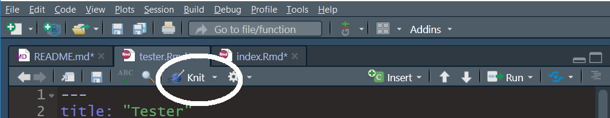

```{r setup, include=FALSE}
knitr::opts_chunk$set(echo = TRUE)
```

This file should help you discover if you are set up for the tutorial.

Hit the knit button on bar above.



```{r pkgs}
library(reticulate)
library(ggplot2)
library(readxl)
```

```{python mods}
import os
import pandas as pd

# for PCA
from sklearn.decomposition.pca import PCA

# for plotting
import matplotlib.pyplot as plt
```

```{r make-data}
df <- data.frame(x = rnorm(50), y = rnorm(50), gp = rep(c("A","B"), each = 25))

```

```{python calc}
# summarise
r.df.shape
r.df["x"].mean()
r.df["y"].mean()
type(r.df)
```

```{python fig}
a = r.df.loc[r.df['gp'] == "A"]
b = r.df.loc[r.df['gp'] == "B"]
plt.figure()
plt.scatter(a['x'], b['y'], label = "A")
plt.scatter(b['x'], b['y'], label = "B")
plt.legend()
plt.show()

```

